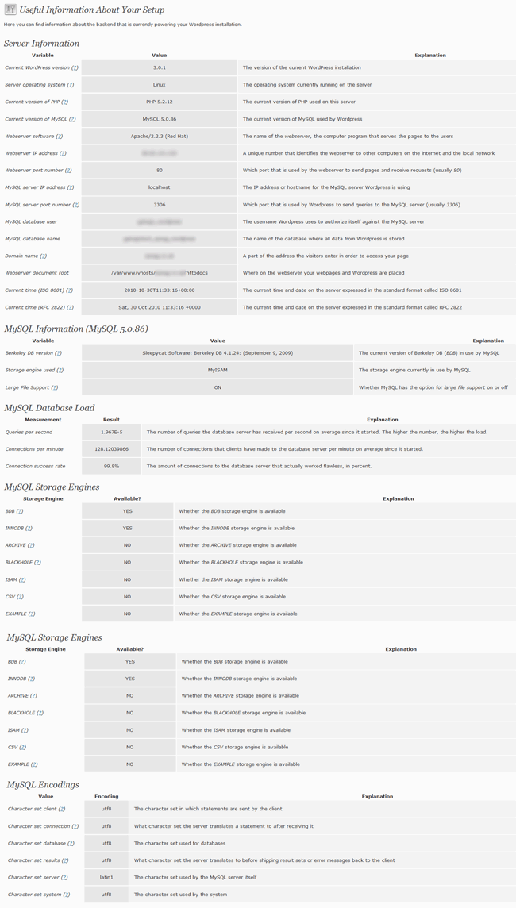

# Diagnosis 

Adds pages to the Dashboard menu with technical details about PHP, MySQL and other server details an administrator might need.

## Description

It is hard for novice WordPress users to find out what the backbone of their hosting is made up of. Some plugins may require a specific version of the PHP scripting language or a certain version of the MySQL database management software.

Diagnosis adds pages to the Dashboard menu where the main administrator of the Wordpress installation can view technical data about the server in an easy manner along with a suitable explanation. Most fields also have a link to an appropriate Wikipedia article.

This plugin is predominantly based on the original Diagnosis plugin: http://nlindblad.org/wordpress/diagnosis/

## Screenshots

_Screenshot 1 caption HERE._

## Requirements
 * WordPress 3.2 (tested up to WP 3.9)

## Installation

### Upload

1. Download the latest tagged archive (choose the "zip" option).
2. Go to the __Plugins -> Add New__ screen and click the __Upload__ tab.
3. Upload the zipped archive directly.
4. Go to the Plugins screen and click __Activate__.

### Manual

1. Download the latest tagged archive (choose the "zip" option).
2. Unzip the archive.
3. Copy the folder to your `/wp-content/plugins/` directory.
4. Go to the Plugins screen and click __Activate__.

Check out the Codex for more information about [installing plugins manually](http://codex.wordpress.org/Managing_Plugins#Manual_Plugin_Installation).

### Git

Using git, browse to your `/wp-content/plugins/` directory and clone this repository:

`git clone git@github.com:GaryJones/diagnosis.git`

Then go to your Plugins screen and click __Activate__.

## Updates

This plugin supports the [GitHub Updater](https://github.com/afragen/github-updater) plugin, so if you install that, this plugin becomes automatically updateable direct from GitHub.

## Usage

After activation, look under the Dashboard menu for two new links - Diagnosis and PHP Info.

## Credits

Built by [Gary Jones](https://twitter.com/GaryJ)  
Copyright 2013 [Gamajo Tech](http://gamajo.com/)
